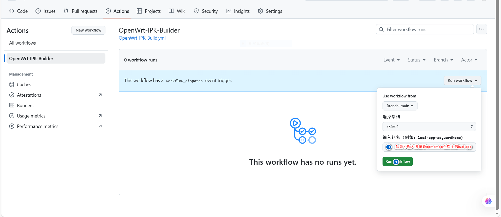

# 编译状态

## 编译注意

Girhub Actions在线编译Openwrt的插件，使用上游最新源码！
1. 选择需要的架构（如不存在，自行在添加后再选择）

2. 如需同时编译多个插件，在输入框输入多个软件包的名字（用空格或,或;隔开）；如果没输入包名，将默认编译somemoo' packages仓库里面全部luci-app

3. 如需定制插件，在App自行添加自己的脚本，脚本名字和要编译的插件包名相同

## 编译方法

## 参考感谢

1. 默认插件仓库：[somemoo' packages](https://github.com/somemoo/OpenWrt-packages "https://github.com/somemoo/OpenWrt-packages")
2. 备用插件仓库：[kiddin9' packages](https://github.com/kiddin9/kwrt-packages "https://github.com/kiddin9/kwrt-packages")
